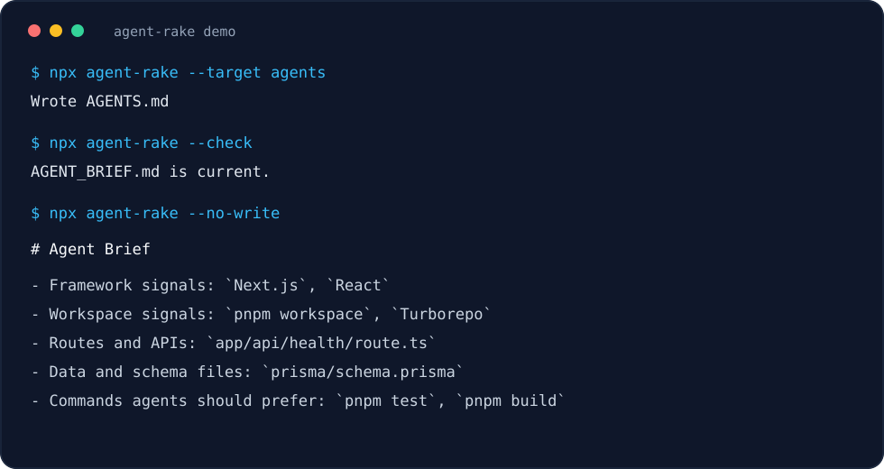

# agent-rake

[](https://github.com/Arthav/rake/actions/workflows/ci.yml)


**Rake any repository into an agent-ready brief before your AI coding agent touches it.**

`agent-rake` is a zero-dependency Node CLI that scans a repo and generates a compact
`AGENT_BRIEF.md`: the commands, entrypoints, tests, config, docs, CI, env examples,
and risky files an agent should inspect first.

No API key. No model call. No telemetry. No hidden network request.



```bash
npx agent-rake
```

## Why This Exists

AI coding agents are powerful, but they still burn context rediscovering the same
repo facts: where the app starts, which test command is real, whether there is an
`AGENTS.md`, where routes live, and which files look security-sensitive.

That is waste.

`agent-rake` gives every agent run a source-derived map first. The output is short
enough to paste into a context window, deterministic enough to commit, and boring
enough to trust in CI.

## Why This Is Worth A Star

- **It makes agent sessions start smarter.** Run it before Codex, Claude Code,
  Cursor, Copilot, or your own automation.
- **It is local-only by design.** Repo structure is scanned on your machine; nothing
  is uploaded.
- **It is dependency-free.** No install tree, no framework lock-in, no runtime bloat.
- **It is conservative.** It prefers obvious source signals over clever guesses.
- **It has a fast preflight.** `--summary` gives a readable terminal snapshot
  without writing files.
- **It is CI-friendly.** `--check` fails when the committed brief is missing or stale.
- **It is integration-friendly.** `--json` gives power users and scripts structured
  scan output.

## Quick Start

Create `AGENT_BRIEF.md` in the current repository:

```bash
npx agent-rake
```

Install globally if you want it everywhere:

```bash
npm install -g agent-rake
agent-rake
```

Run from this checkout:

```bash
node ./bin/agent-rake.js --help
npm run smoke
```

## Common Workflows

Generate the default brief:

```bash
agent-rake
```

Bootstrap a repo with config, CI, and a fresh brief:

```bash
agent-rake --setup
agent-rake --setup --target all
agent-rake --setup --ignore dist --max-files 1000
```

Check whether the committed brief is current:

```bash
agent-rake --check
```

Show the changed brief lines when the committed brief is stale:

```bash
agent-rake --diff
```

Print a GitHub Actions workflow for committed-brief checks:

```bash
agent-rake --github-actions
```

Install the GitHub Actions workflow if it does not already exist:

```bash
agent-rake --install-github-actions
```

Fail when the committed brief is stale or scan warnings are present:

```bash
agent-rake --check --strict
```

Get a quick scan summary without writing a file:

```bash
agent-rake --summary
```

Diagnose scan warnings, fix suggestions, and generated-output freshness:

```bash
agent-rake --doctor
agent-rake --doctor --strict
agent-rake --doctor --target all
```

Scan another repository:

```bash
agent-rake ../my-app
```

Print Markdown instead of writing a file:

```bash
agent-rake --no-write
agent-rake --dry-run
```

Write to a custom output file:

```bash
agent-rake --out AGENTS.md
```

Write to a known agent instruction target:

```bash
agent-rake --targets
agent-rake --target all
agent-rake --target claude
agent-rake --target cursor
```

Print shell completion scripts:

```bash
agent-rake --completion bash
agent-rake --completion zsh
agent-rake --completion fish
agent-rake --completion powershell
```

Use JSON for scripts, dashboards, or custom agent launchers:

```bash
agent-rake --json
```

Show why commands, framework signals, and files were included:

```bash
agent-rake --explain --no-write
```

Cap scan size for very large repos:

```bash
agent-rake --max-files 1000
```

Skip repo-specific generated or fixture paths:

```bash
agent-rake --ignore fixtures --ignore src/generated
```

Commit repeatable scan settings:

```bash
agent-rake --config-example
agent-rake --init-config
agent-rake --init-config --target all
agent-rake --init-config --ignore dist --max-files 1000
```

```json
{
  "ignore": ["fixtures", "src/generated"],
  "maxFiles": 3000,
  "output": "AGENT_BRIEF.md"
}
```

`agent-rake` reads `.agent-rake.json` by default. Use `--config <file>` for a
different JSON config or `--no-config` to ignore config discovery.
`--init-config` writes the active CLI settings you pass for `--ignore`,
`--max-files`, `--out`, or `--target`. It also honors `--config <file>` when you
want a non-default path.
When config sets `"target": "all"`, `agent-rake --setup` writes every known
agent target after installing config and CI.

Inspect the active config after file settings and CLI overrides:

```bash
agent-rake --show-config
agent-rake --show-config --ignore fixtures --max-files 1000
```

Browse common repo shapes in [examples/README.md](./examples/README.md).

## What Agents Get

The generated brief gives an agent the facts it usually needs before editing:

- repo snapshot and primary languages
- framework/runtime signals from manifests and route conventions
- workspace/monorepo signals from common package and build manifests
- detected package manager
- manifests, lockfiles, docs, and existing agent instruction files
- preferred commands from package scripts, ecosystem signals, and root task
  runner files
- entrypoints
- route/API/controller files, including common inline backend route declarations
  for JavaScript, Python, and Go entrypoints plus Phoenix and Spring controller
  conventions
- test files
- database, schema, and migration files, including Ecto and Flyway migrations
- safe env templates, while skipping secret-looking `.env` files
- CI, Docker, task runner, framework config, and PHP quality-tool config files
- risk hotspots such as auth, permissions, payments, webhooks, migrations,
  schemas, queues, cron jobs, secrets, and tokens
- repo-specific rules for cautious agent behavior

Example output:

```markdown
# Agent Brief

Generated by agent-rake for `my-app`.

## Repo Snapshot

- Root: `my-app`
- Files scanned: 428
- Primary languages: TypeScript (81), CSS (12)
- Package manager: pnpm
- Framework signals: `Next.js` (package.json dependency: next), `React` (package.json dependency: react)
- Workspace signals: `pnpm workspace` (pnpm-workspace.yaml), `Turborepo` (turbo.json)
- Data and schema files: `prisma/schema.prisma`

## Commands Agents Should Prefer

- `pnpm test` - package.json script: vitest
- `pnpm build` - package.json script: next build
```

## CLI Reference

| Command | Purpose |
| --- | --- |
| `agent-rake` | Generate `AGENT_BRIEF.md` in the current repo. |
| `agent-rake <path>` | Scan another repo. |
| `agent-rake --check` | Fail if the output file is missing or stale. |
| `agent-rake --diff` | Fail if stale and print a concise generated-vs-current diff. |
| `agent-rake --doctor` | Print actionable scan health checks, fix suggestions, and generated-output freshness. |
| `agent-rake --github-actions` | Print a GitHub Actions workflow for agent-rake checks. |
| `agent-rake --install-github-actions` | Write `.github/workflows/agent-rake.yml` unless it already exists. |
| `agent-rake --setup` | Safely write starter config, CI workflow, and configured generated output in one pass. |
| `agent-rake --summary` | Print a compact repo scan summary without writing a file. |
| `agent-rake --no-write` | Print Markdown to stdout. |
| `agent-rake --dry-run` | Alias for `--no-write`. |
| `agent-rake --json` | Print the scan result as structured JSON. |
| `agent-rake --out <file>` | Write to a custom file, such as `AGENTS.md`. |
| `agent-rake --target <name>` | Write to a known agent file: `agents`, `claude`, `codex`, `copilot`, `cursor`, or `all`. |
| `agent-rake --targets` | List the known `--target` names and output paths. |
| `agent-rake --completion <shell>` | Print a Bash, Zsh, Fish, or PowerShell completion script. |
| `agent-rake --explain` | Include a `Why These Signals` section with classification reasons. |
| `agent-rake --strict` | Exit nonzero when scan warnings are present. With `--doctor`, also fail on missing or stale generated output. |
| `agent-rake --config <file>` | Read config from a JSON file. |
| `agent-rake --config-example` | Print an example `.agent-rake.json` file. |
| `agent-rake --init-config` | Write the active config file unless it already exists. Defaults to `.agent-rake.json`. |
| `agent-rake --show-config` | Print resolved config after config file and CLI overrides. |
| `agent-rake --no-config` | Disable `.agent-rake.json` discovery. |
| `agent-rake --ignore <path>` | Ignore a file, directory, path prefix, or path segment. Repeatable. |
| `agent-rake --max-files <n>` | Limit how many files are scanned. |
| `agent-rake --quiet` | Suppress success output when writing. |
| `agent-rake --version` | Print the package version. |
| `agent-rake --help` | Print help. |

## Power-User Patterns

Use it as a preflight before opening an agent session:

```bash
agent-rake --summary
agent-rake --doctor
agent-rake --no-write
```

Commit the brief and enforce freshness in CI:

```bash
agent-rake --setup
agent-rake --setup --target all
agent-rake
agent-rake --check
agent-rake --diff
agent-rake --github-actions
agent-rake --install-github-actions
agent-rake --check --strict
```

Pipe JSON into your own launcher:

```bash
agent-rake --json > repo-context.json
```

Seed a repo-specific `AGENTS.md`:

```bash
agent-rake --target agents
```

Seed other common agent files without memorizing paths:

```bash
agent-rake --targets
agent-rake --target all      # all known target outputs
agent-rake --target claude   # CLAUDE.md
agent-rake --target codex    # CODEX.md
agent-rake --target copilot  # .github/copilot-instructions.md
agent-rake --target cursor   # .cursor/rules/agent-rake.mdc
```

Compare a generated brief against known patterns:

- [Next.js app](./examples/README.md#nextjs-app)
- [Python API](./examples/README.md#python-api)
- [Go service](./examples/README.md#go-service)
- [Phoenix app](./examples/README.md#phoenix-app)
- [Rails app](./examples/README.md#rails-app)
- [PHP framework app](./examples/README.md#php-framework-app)
- [Spring app](./examples/README.md#spring-app)
- [JavaScript monorepo](./examples/README.md#javascript-monorepo)
- [Task runner repo](./examples/README.md#task-runner-repo)

Debug surprising output:

```bash
agent-rake --explain --no-write
agent-rake --json --explain
agent-rake --doctor --target all
```

Install shell completions using the script your shell expects:

```bash
agent-rake --completion bash > agent-rake-completion.bash
agent-rake --completion zsh > _agent-rake
agent-rake --completion fish > agent-rake.fish
agent-rake --completion powershell > agent-rake-completion.ps1
```

For PowerShell, dot-source the generated `.ps1` from your `$PROFILE` so the
native completer is registered in new sessions.

Completions include target names, supported shells, option names, and path
completion for path-like flags such as `--root`, `--out`, `--config`, and
`--ignore`.

Bootstrap repeatable repo settings without memorizing the config shape:

```bash
agent-rake --setup
agent-rake --setup --target all
agent-rake --setup --ignore dist --max-files 1000
agent-rake --config-example
agent-rake --init-config
agent-rake --init-config --target all
agent-rake --show-config
agent-rake --config config/agent-rake.json --init-config
agent-rake --config config/agent-rake.json --show-config
agent-rake --init-config --force
```

Fail CI when the scan found risky gaps, such as missing manifests, missing
lockfiles, missing agent instructions, truncated scans, or stale generated
output in doctor mode:

```bash
agent-rake --check --strict
agent-rake --doctor --strict
```

## Trust Model

`agent-rake` is intentionally small:

- zero runtime dependencies
- Node.js standard library only
- no network calls
- no telemetry
- no model provider
- no broad source-content ingestion during normal scans
- deterministic Markdown output for review and CI
- conservative detection over magical inference

The scanner reads bounded manifest and root task-runner data where needed, such
as `package.json`, `Makefile`, `justfile`, and `Taskfile.yml`. Otherwise it
works from file paths, names, and sizes, except for a small route-declaration
peek on likely entrypoint files below 128KB. Framework and workspace signals
come from manifests and conservative path conventions.
Rails routes, Laravel routes, Symfony config, Phoenix routers, Spring
controllers, Ecto migrations, and Flyway migrations are detected from their
conventional paths.
Secret-looking `.env` files are detected for warnings but not listed as context
files. Custom `--ignore` entries are matched against normalized relative paths
and path segments before files are added to the metadata scan.

Config files are JSON objects. Supported keys are `ignore`, `maxFiles`, `output`,
and `target`; command-line flags override config values.

## Development

```bash
npm test
npm run smoke
npm run smoke:modes
npm run brief:check
npm run release:check
```

The project has no runtime dependencies. Keep it that way unless a feature is
impossible without one.

`src/index.js` remains the public API entrypoint. Internal implementation details
can move into focused modules such as `src/constants.js`, `src/renderers.js`,
and `src/scanner.js` as long as the public exports stay stable.

Run `npm run release:check` before publishing. It runs tests, default smoke
output, mode-specific smoke checks, stale-brief verification, and an npm package
dry run with the workspace-local npm cache. The GitHub Actions workflow runs the
same release check.

See [RELEASE.md](./RELEASE.md) for the publish checklist and current metadata
notes.

## Roadmap

Near-term work is focused on sharper framework detection, better monorepo signals,
agent-specific output targets, launch-quality examples, and structured public
feedback. See [ROADMAP.md](./ROADMAP.md).

## License

MIT
